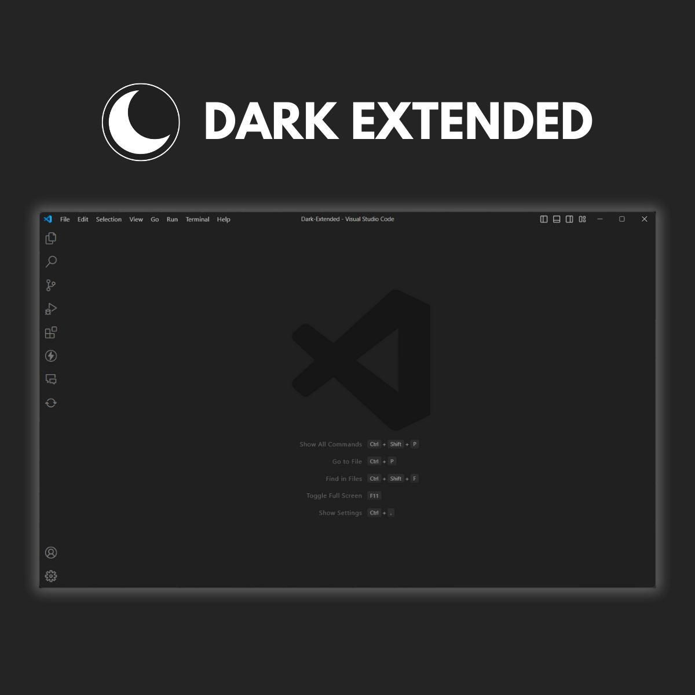
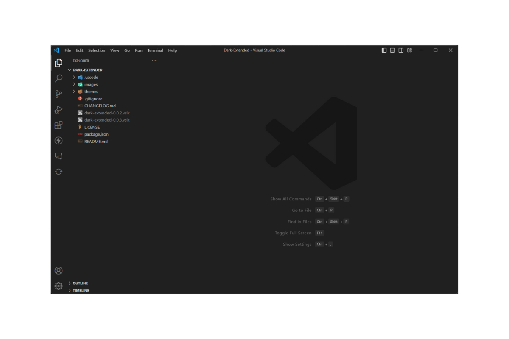
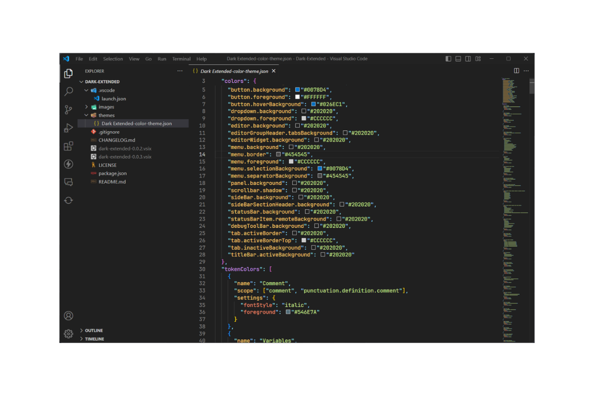

# Dark Extended for VS Code

## Easy Installation

1. Open the extensions sidebar on Visual Studio Code
2. Search for **Dark Extended**
3. Click **Install** to install it.
4. Click **Reload** to reload your editor.
5. Code/File ＞ Preferences ＞ Color Theme ＞ **Dark Extended**.
6. 🌟 Enjoy and [Rate five-stars](https://marketplace.visualstudio.com/items?itemName=Luscarvalho.dark-extended&ssr=false#review-details).
